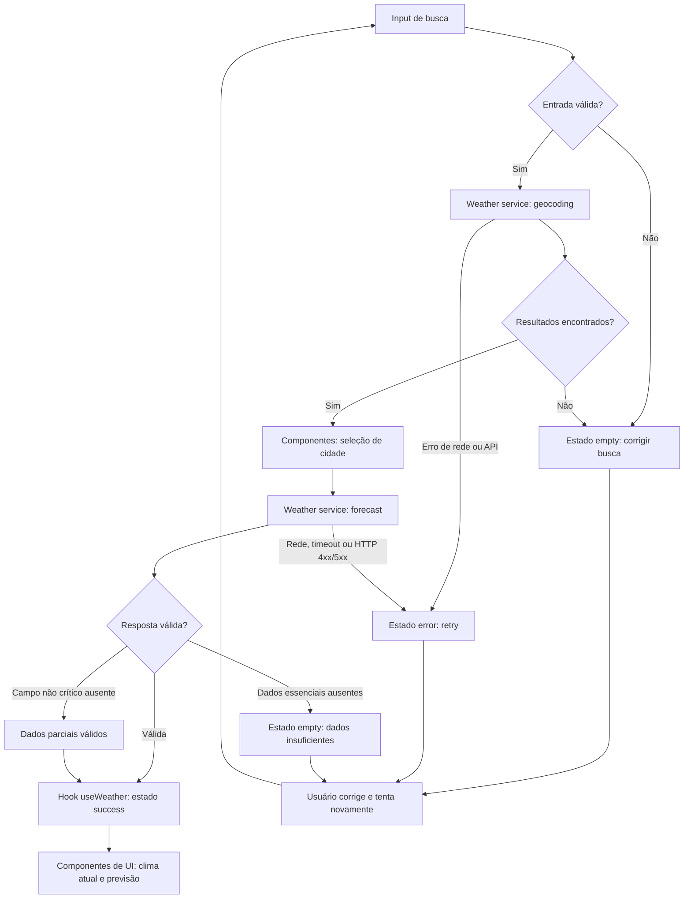

# Weather App — Plano Técnico

## Architecture

### Visão geral

A aplicação será um front-end React sem backend próprio no MVP. A composição será dividida em quatro camadas simples:

```text
UI Components
      |
useWeather / estado da tela
      |
Weather Service
  /           \
Geocoding API  Forecast API
      |
Normalização para o modelo interno
```

- **UI:** busca, seleção de cidade, clima atual, previsão, toggle de unidade e estados visuais.
- **Hook de domínio:** coordena busca, seleção, loading, sucesso, vazio e erro.
- **Service:** encapsula URLs, parâmetros, `fetch`, timeout, validação e normalização das respostas Open-Meteo.
- **Lib:** funções puras para conversão de temperatura, formatação de datas e tradução de códigos meteorológicos.

O serviço será acessado diretamente pelo navegador, conforme a decisão da spec. O componente não conhecerá endpoints nem o formato bruto da API.

### Fronteiras de responsabilidade

| Camada | Responsabilidade | Não deve fazer |
| --- | --- | --- |
| `components/` | Renderizar dados, receber eventos do usuário e comunicar estados visuais. | Montar URLs, chamar `fetch` ou conter regras de conversão. |
| `hooks/` | Orquestrar eventos, transições de estado, seleção de cidade e concorrência de requests. | Conhecer detalhes do JSON bruto ou duplicar regras de apresentação. |
| `services/` | Acessar Open-Meteo, classificar erros, validar respostas e produzir modelos internos. | Renderizar UI ou decidir layout. |
| `lib/` | Executar transformações determinísticas, como conversão, arredondamento, datas e códigos WMO. | Fazer I/O, acessar React ou manter estado. |
| `types/` | Definir contratos compartilhados entre as camadas. | Implementar comportamento ou efeitos colaterais. |

As dependências devem fluir de cima para baixo: `components` consome `hooks`, `hooks` consome `services` e `lib`, e `services` usa `types` e `lib` para normalização. `lib` e `types` permanecem independentes da UI.

### Por que essa separação facilita os testes

- **Components:** podem ser renderizados com dados e estados controlados, validando acessibilidade, conteúdo e interação sem rede.
- **Hooks:** podem testar transições `idle → loading → success/error`, retry e descarte de respostas antigas com services substituídos na fronteira.
- **Services:** podem testar URLs, parâmetros, validação e classificação de erros interceptando `fetch`, sem depender de componentes.
- **Lib:** são funções puras e determinísticas; cada entrada produz uma saída verificável, sem mocks ou ambiente de navegador.
- **Types:** tornam incompatibilidades entre a resposta normalizada e a UI detectáveis pelo TypeScript no build.

### Rastreabilidade

- Busca e seleção: `FR-01`, `FR-02`, `AC-01` a `AC-02b`.
- Clima atual e previsão: `FR-03`, `FR-04`, `FR-10`, `AC-03` a `AC-04` e `AC-10`.
- Unidade: `FR-05`, `AC-05`.
- Estados e concorrência: `FR-06` a `FR-09`, `AC-06` a `AC-14`.
- Responsividade, performance e acessibilidade: `NFR-01` a `NFR-09`.

## Tech Stack

| Tecnologia | Uso | Justificativa |
| --- | --- | --- |
| TypeScript strict | Tipos e contratos | Reduz erros nos dados externos e mantém os modelos explícitos. |
| React | Componentes e composição da tela | Stack definida pelo projeto e adequada ao fluxo interativo. |
| Vite | Desenvolvimento e build | Ferramenta já adotada pelo repositório. |
| Tailwind CSS | Estilos responsivos | Mantém os estilos próximos dos componentes e facilita os viewports da spec. |
| Vitest + Testing Library | Testes unitários e de componentes | Validam funções puras e comportamento da UI. |
| Playwright | Testes E2E | Valida fluxos reais em navegador e viewports definidos. |
| Biome | Lint e formatação | Ferramenta já configurada no projeto. |
| `fetch` nativo | Comunicação com Open-Meteo | Evita dependência adicional para duas integrações HTTP simples. |

Não será introduzido gerenciador global de estado, cliente HTTP adicional ou biblioteca de cache no MVP.

## Project Structure

```text
src/
├── App.tsx                         # Composição da tela e estado de unidade
├── main.tsx                        # Bootstrap React
├── components/
│   ├── SearchBar.tsx               # Input e submit; sem acesso à API
│   ├── CityResults.tsx             # Resultados e seleção de cidade
│   ├── CurrentWeather.tsx          # Dados atuais formatados
│   ├── ForecastList.tsx            # Lista de cinco dias
│   ├── ForecastCard.tsx             # Item diário
│   ├── UnitToggle.tsx              # Controle Celsius/Fahrenheit
│   └── states/                     # Loading, vazio e erro
├── hooks/
│   └── useWeather.ts               # Orquestração, estado e concorrência
├── services/
│   └── weatherService.ts           # Open-Meteo, validação e normalização
├── lib/
│   ├── format.ts                   # Datas, números e textos pt-BR
│   ├── temperature.ts              # Conversão e arredondamento
│   └── weatherCodes.ts             # Código WMO para condição em pt-BR
├── types/
│   └── weather.ts                  # Contratos compartilhados
└── styles/
    └── index.css                   # Tailwind e estilos globais
```

`CityResults.tsx` pode ser incorporado ao `SearchBar.tsx` se a implementação permanecer pequena; a separação acima é preferível para testar seleção e resultados homônimos isoladamente.

## Data Model

Os tipos abaixo são contratos de domínio, não código final. O service deve converter o formato externo para esses modelos antes de entregá-los à UI.

```ts
type Unit = 'celsius' | 'fahrenheit'

interface City {
  id: number // Identificador da cidade no geocoding.
  name: string // Nome da cidade.
  latitude: number // Latitude usada na consulta de previsão.
  longitude: number // Longitude usada na consulta de previsão.
  country?: string // Nome do país, quando retornado.
  countryCode?: string // Código ISO do país, quando retornado.
  region?: string // Estado ou região administrativa, quando retornado.
  timezone: string // Fuso horário IANA da cidade.
}

interface WeatherCondition {
  code: number // Código WMO retornado pela Open-Meteo.
  label?: string // Descrição em pt-BR derivada do código.
}

interface CurrentWeather {
  measuredAt: string // Horário da medição no timezone da cidade.
  temperatureCelsius: number // Temperatura atual em Celsius no modelo interno.
  condition: WeatherCondition // Condição atual derivada de weather_code.
}

interface ForecastDay {
  date: string // Data local da cidade, no formato ISO YYYY-MM-DD.
  temperatureMaxCelsius: number // Temperatura máxima diária em Celsius.
  temperatureMinCelsius: number // Temperatura mínima diária em Celsius.
  condition?: WeatherCondition // Condição diária, quando o código estiver disponível.
}

interface WeatherData {
  city: City // Cidade selecionada pelo usuário.
  current: CurrentWeather // Condições meteorológicas atuais.
  daily: ForecastDay[] // Previsão de hoje e dos quatro dias seguintes.
}
```

### Regras do modelo

- Temperaturas ficam em Celsius no modelo interno; conversão ocorre somente na apresentação (`FR-05`, `NFR-07`).
- `Unit` é usado somente para apresentação e inicia como `celsius`.
- `daily` deve conter exatamente cinco itens `ForecastDay` válidos para estado de sucesso (`FR-04`, `FR-10`).
- `City.timezone` é obrigatório para formatar datas no fuso da cidade.
- `CurrentWeather.condition` é obrigatório para sucesso do clima atual.
- `ForecastDay.condition` é opcional; ausência deve ser indicada na UI.
- Uma previsão sem data, mínima ou máxima não é válida (`FR-08`).
- Temperaturas exibidas são arredondadas ao inteiro mais próximo.

### Estado da consulta

```ts
type WeatherStatus = 'idle' | 'loading' | 'success' | 'empty' | 'error'

interface WeatherError {
  kind: 'invalid-input' | 'not-found' | 'timeout' | 'rate-limit' | 'network' | 'invalid-response'
  retryable: boolean
  message: string
}
```

O estado da tela deve manter `searchStatus`, `weatherStatus`, `query`, `cityResults`, `selectedCity`, `data` e os erros correspondentes de forma explícita. A busca de cidades e a consulta de forecast são operações distintas; cada uma precisa do seu próprio status para evitar representar resultados de geocoding como se fossem clima carregado. `data` não deve ser usado como resultado atual quando `weatherStatus` for `error` ou `empty`.

## Data Flow



1. O usuário digita uma cidade e envia o formulário.
2. A UI remove espaços nas extremidades e bloqueia input vazio ou composto apenas por símbolos.
3. `useWeather` inicia uma operação identificada por um request id e muda o estado para `loading`.
4. `weatherService.searchCities(query)` chama o endpoint de geocoding.
5. A UI exibe resultados com cidade, região/estado e país quando disponíveis.
6. O usuário seleciona uma cidade; a seleção dispara `weatherService.getForecast(city)`.
7. O service chama o forecast com `temperature_unit=celsius`, `timezone=auto`, `forecast_days=5` e as variáveis definidas em `External APIs`.
8. O service valida e normaliza a resposta para `WeatherData`.
9. O hook descarta respostas cujo request id da operação correspondente não seja o mais recente.
10. Em `weatherStatus=success`, a UI renderiza clima atual e cinco dias; em vazio ou erro, renderiza o estado correspondente.
11. O toggle altera apenas `Unit`; não refaz a consulta.
12. `format.ts` usa o timezone da cidade para apresentar datas e horas em pt-BR.

## External APIs

### Geocoding

- **Base:** `https://geocoding-api.open-meteo.com/v1/search`
- **URL de exemplo:** `https://geocoding-api.open-meteo.com/v1/search?name=Sao%20Paulo&count=10&language=pt&format=json`
- **Parâmetros relevantes:**
  - `name`: texto normalizado informado pelo usuário.
  - `count=10`: limite de resultados para permitir seleção entre cidades homônimas.
  - `language=pt`: solicita nomes e países em português quando suportado.
  - `format=json`: formato esperado da resposta.
- **Uso:** localizar cidades para `FR-01` e `FR-02`.
- **Resposta usada:** `id`, `name`, `latitude`, `longitude`, `country`, `admin1` e `timezone`.
- **Sem resultados:** retornar estado `empty`; não chamar o forecast.

Exemplo resumido:

```json
{
  "results": [
    {
      "id": 3448439,
      "name": "São Paulo",
      "latitude": -23.5475,
      "longitude": -46.6361,
      "country_code": "BR",
      "country": "Brasil",
      "admin1": "São Paulo",
      "timezone": "America/Sao_Paulo"
    }
  ]
}
```

Mapeamento para `City`:

| Open-Meteo | `City` | Regra |
| --- | --- | --- |
| `id` | `id` | Obrigatório. |
| `name` | `name` | Obrigatório. |
| `latitude` | `latitude` | Obrigatório para forecast. |
| `longitude` | `longitude` | Obrigatório para forecast. |
| `country` | `country` | Opcional para exibição. |
| `country_code` | `countryCode` | Opcional para identificação. |
| `admin1` | `region` | Opcional para diferenciar homônimos. |
| `timezone` | `timezone` | Obrigatório para formatar datas locais. |

### Forecast

- **Base:** `https://api.open-meteo.com/v1/forecast`
- **URL de exemplo:** `https://api.open-meteo.com/v1/forecast?latitude=-23.5475&longitude=-46.6361&temperature_unit=celsius&current=temperature_2m,weather_code&daily=weather_code,temperature_2m_max,temperature_2m_min&timezone=auto&forecast_days=5`
- **Parâmetros relevantes:**
  - `latitude` e `longitude`: coordenadas do `City` selecionado.
  - `temperature_unit=celsius`: unidade canônica do modelo interno.
  - `current=temperature_2m,weather_code`: temperatura atual e código WMO atual.
  - `daily=weather_code,temperature_2m_max,temperature_2m_min`: séries diárias necessárias para cinco dias.
  - `timezone=auto`: retorna datas e horários no fuso da coordenada.
  - `forecast_days=5`: solicita hoje e os quatro dias seguintes.
- **Uso:** clima atual e previsão diária para `FR-03`, `FR-04` e `FR-10`.
- **Resposta usada:** timezone, current time, current temperature, current weather code, daily dates, daily maximums, daily minimums e daily weather codes.
- **Unidade:** solicitar Celsius na API e converter para Fahrenheit apenas na apresentação.

Exemplo resumido:

```json
{
  "timezone": "America/Sao_Paulo",
  "current": {
    "time": "2026-09-30T12:00",
    "temperature_2m": 22.4,
    "weather_code": 3
  },
  "daily": {
    "time": ["2026-09-30", "2026-10-01", "2026-10-02", "2026-10-03", "2026-10-04"],
    "weather_code": [3, 61, 2, 1, 1],
    "temperature_2m_max": [24.1, 21.8, 25.0, 26.2, 27.4],
    "temperature_2m_min": [17.2, 16.4, 18.1, 18.8, 19.0]
  }
}
```

Mapeamento para `WeatherData`:

| Open-Meteo | Modelo | Regra |
| --- | --- | --- |
| cidade normalizada do geocoding | `WeatherData.city` | Reutilizar o `City` selecionado. |
| `timezone` | `City.timezone` | O timezone do forecast é a fonte final para a consulta. |
| `current.time` | `CurrentWeather.measuredAt` | Manter como timestamp da medição. |
| `current.temperature_2m` | `CurrentWeather.temperatureCelsius` | Receber em Celsius e validar como número. |
| `current.weather_code` | `CurrentWeather.condition.code` | Traduzir depois por `weatherCodes.ts`. |
| `daily.time[i]` | `ForecastDay.date` | Combinar pelo mesmo índice `i`. |
| `daily.temperature_2m_max[i]` | `ForecastDay.temperatureMaxCelsius` | Validar número e manter Celsius. |
| `daily.temperature_2m_min[i]` | `ForecastDay.temperatureMinCelsius` | Validar número e manter Celsius. |
| `daily.weather_code[i]` | `ForecastDay.condition.code` | Opcional; indicar indisponibilidade se ausente. |

As quatro séries `daily.*` devem ter o mesmo comprimento. O service deve rejeitar a resposta como previsão válida se houver menos de cinco datas, ou se faltar data, máxima ou mínima em qualquer posição. O valor textual da condição não vem pronto da API: `weatherCodes.ts` converte o código WMO em label pt-BR.

### Regras HTTP

- Respostas fora de `2xx` são erros.
- JSON inválido ou campos essenciais ausentes produzem `invalid-response`.
- Timeout de 10 segundos produz `timeout`.
- `429` produz `rate-limit`.
- Falha de conexão produz `network`.
- O service não deve expor o formato bruto da API aos componentes.

## State Management

O estado ficará local ao fluxo principal, coordenado por `useWeather`, com `useState` ou `useReducer` simples. A escolha entre os dois deve ser feita pela complexidade real da implementação; não haverá store global. `App` manterá apenas a unidade selecionada e passará dados/handlers aos componentes de apresentação.

O service é stateless: não mantém dados de usuário, histórico ou cache persistente. O hook é o único responsável por publicar mudanças de estado da consulta.

### Estado recomendado

- `query`: texto atual do input.
- `cityResults`: resultados da última busca válida.
- `selectedCity`: cidade escolhida.
- `weather`: `WeatherData` normalizado.
- `searchStatus`: `WeatherStatus` para geocoding.
- `weatherStatus`: `WeatherStatus` para forecast.
- `searchError`: `WeatherError | null`.
- `weatherError`: `WeatherError | null`.
- `unit`: `Unit`, inicializado como `celsius` no `App`.
- `searchRequestId` e `weatherRequestId`: proteção contra respostas fora de ordem.
- `AbortController`: cancelamento da requisição ativa quando o timeout de 10 segundos é atingido.

### Estados explícitos

| Estado | Quando ocorre | Dados exibidos | Ações permitidas |
| --- | --- | --- | --- |
| `idle` | Inicialização, antes de uma busca | Tela inicial/vazia | Informar cidade e iniciar busca. |
| `loading` | Busca de cidade ou forecast em andamento | Indicador de carregamento; não declarar sucesso | Cancelar/ser substituído por nova busca, conforme a UI. |
| `success` | Geocoding com resultados ou forecast válido | Resultados de cidades; ou cidade, clima atual e cinco dias | Selecionar cidade; ou nova busca e alternância de unidade. |
| `empty` | Input inválido, geocoding sem resultados ou dados insuficientes | Mensagem de vazio/validação | Corrigir busca ou tentar novamente. |
| `error` | Rede, API, timeout, rate limit ou resposta inválida | Mensagem acionável de erro | Tentar novamente ou iniciar nova busca. |

As transições de cada operação são independentes:

```text
idle -> loading -> success
idle -> loading -> empty
idle -> loading -> error
success -> loading -> success | empty | error
empty -> loading -> success | empty | error
error -> loading -> success | empty | error
```

Uma busca nova incrementa `searchRequestId`; um forecast novo incrementa `weatherRequestId`. Apenas a operação mais recente de cada tipo pode publicar `success`, `empty` ou `error`. `AbortController` cancela a chamada ativa no timeout, mas não é o mecanismo de precedência entre respostas.

### Derivação de unidade

- O `WeatherData` permanece sempre em Celsius; a API é solicitada em Celsius.
- `unit` é estado de apresentação, inicializado como `celsius` e mantido fora de `WeatherData`.
- A renderização chama uma função pura equivalente a `formatTemperature(valueCelsius, unit)`.
- Para Celsius, usar o valor original; para Fahrenheit, aplicar $F = C \times \frac{9}{5} + 32$.
- Arredondar somente o valor exibido para o inteiro mais próximo e acrescentar `°C` ou `°F`.
- Alterar `unit` deve atualizar o clima atual e todos os cards diários sem alterar `WeatherData` e sem iniciar request.

### Invariantes

- `searchStatus = success` implica `cityResults` não vazio; `weatherStatus` permanece `idle` até a seleção.
- `weatherStatus = success` implica `weather` com campos essenciais válidos e cinco previsões válidas; campos não críticos podem estar ausentes e devem ser indicados na UI.
- Qualquer status `loading` mostra indicador para a operação correspondente e impede resposta antiga de finalizar a UI.
- `searchStatus = empty` não chama forecast quando o geocoding não encontrou cidades.
- `weatherStatus = error` permite nova tentativa e não trata `weather` antigo como resultado atual.
- Alterar `unit` não altera `weather` nem dispara request.

## Error Handling

| Situação | Estado | Comportamento |
| --- | --- | --- |
| Input vazio ou apenas símbolos | `empty`/validação local | Não chamar API; informar correção no campo. |
| Geocoding sem resultados | `empty` | Informar cidade não encontrada; manter nova busca disponível. |
| Várias cidades homônimas | `success` de busca | Mostrar contexto geográfico e aguardar seleção. |
| Forecast incompleto com campo não crítico ausente | `success` parcial | Mostrar dados válidos e indicar o campo indisponível. |
| Forecast sem data, mínima ou máxima | `empty` ou `error/invalid-response` | Mostrar dados insuficientes; nunca renderizar a entrada como previsão válida. |
| Rede indisponível | `error/network` | Encerrar loading, não substituir a tela por dados antigos, informar falha e permitir retry. |
| API responde fora de `2xx` | `error` conforme status | Classificar o status, informar o problema sem expor detalhes internos e permitir retry quando aplicável. |
| Timeout após 10 s | `error/timeout` | Encerrar loading, informar demora e permitir retry. |
| Rate limit (`429`) | `error/rate-limit` | Informar indisponibilidade temporária e permitir nova tentativa posterior. |
| JSON inválido ou campos essenciais ausentes | `error/invalid-response` | Não renderizar dados; informar resposta inválida e permitir nova tentativa. |
| Busca concorrente | estado da request mais recente | Comparar `searchRequestId` ou `weatherRequestId` e ignorar resposta antiga; somente a última operação atualiza a UI. |

Mensagens visíveis e labels devem estar em pt-BR. O erro deve ser acionável, mas não precisa expor detalhes técnicos da API. Dados antigos podem permanecer em memória para descarte, mas nunca devem ser apresentados como resultado da operação que falhou.

## Testing Strategy

### Vitest

#### Funções puras

Cobrir sem rede, DOM ou mocks:

- conversão Celsius/Fahrenheit e arredondamento em `temperature.ts`, incluindo zero, negativos e valores decimais;
- formatação de datas/horários em pt-BR no timezone da cidade em `format.ts`;
- tradução de códigos WMO conhecidos e fallback para código desconhecido em `weatherCodes.ts`;
- normalização de input, incluindo espaços, acentos, hífens, apóstrofos e entradas compostas apenas por símbolos.

Cada teste deve verificar valor retornado e casos de borda, sem testar detalhes internos da implementação.

#### Services com mock de `fetch`

Interceptar `fetch` na fronteira HTTP e validar comportamento do service:

- URL e parâmetros corretos para geocoding e forecast;
- transformação de resultados do geocoding para `City`;
- transformação de `current` e séries `daily` para `WeatherData`;
- exatamente cinco dias válidos;
- resposta parcial com campo não crítico ausente;
- rejeição de data, mínima ou máxima ausente;
- respostas fora de `2xx`, `429`, JSON inválido e campos essenciais ausentes;
- timeout após 10 segundos e falha de rede.

Os testes devem verificar o contrato normalizado e o tipo de erro produzido, não apenas que `fetch` foi chamado.

#### Componentes e hook

Usar Testing Library para validar comportamento observável nos estados:

- `idle`: formulário inicial e controles disponíveis;
- `loading`: indicador visível e ausência de mensagem de sucesso;
- `success`: cidade, clima atual, cinco dias e unidade correta;
- `empty`: input inválido, geocoding sem resultados e dados insuficientes;
- `error`: mensagem acionável, retry e encerramento do loading;
- resultados homônimos exibem contexto e permitem seleção;
- toggle converte valores sem nova chamada de forecast;
- resposta antiga não substitui a busca mais recente;
- mensagens, labels, foco e operação por teclado estão em pt-BR e acessíveis.

O foco deve ser o comportamento renderizado e as interações reais do usuário, evitando métodos de produção exclusivos para testes e asserções baseadas apenas em mocks.

### Playwright

Os testes E2E devem validar o fluxo completo no navegador, interceptando as APIs externas no limite HTTP para manter cenários determinísticos:

- buscar uma cidade, selecionar um resultado e visualizar o clima atual;
- visualizar exatamente cinco dias no timezone retornado para a cidade;
- alternar Celsius/Fahrenheit sem nova requisição de forecast;
- validar input vazio, caracteres válidos e cidade inexistente;
- validar resposta parcial, falha de rede, timeout, rate limit e retry;
- validar concorrência: resposta antiga não substitui a busca mais recente;
- navegar pela busca, resultados e toggle apenas com teclado;
- executar nos viewports `375x667`, `768x1024` e `1440x900` sem rolagem horizontal.
- medir o loading em até 100 ms e a renderização até 2 s após resposta válida em build de produção, viewport `375x667` e conexão aproximada de 10 Mbps.

Os cenários E2E devem afirmar conteúdo e estados visíveis. A interceptação de rede serve para controlar entradas e falhas, não para substituir a validação do comportamento da aplicação.

### Validação de qualidade

Antes de considerar uma tarefa concluída:

```text
pnpm lint
pnpm build
pnpm test
pnpm test:e2e
```

## Risks & Trade-offs

| Decisão / risco | Escolha | Trade-off / mitigação |
| --- | --- | --- |
| API direta no navegador | Usar Open-Meteo diretamente no MVP | Simples e sem backend, mas depende de CORS e limites públicos; migrar para proxy se necessário. |
| Sem estado global | Estado em `useWeather` e `App` | Menor complexidade; suficiente porque não há autenticação, histórico ou múltiplas páginas. |
| Sem cache persistente | Consultas sob demanda | Evita dados desatualizados e armazenamento; pode aumentar chamadas, mitigado por não repetir requests de unidade. |
| Celsius no modelo interno | Converter apenas na UI | Evita inconsistência e nova chamada; exige testes de arredondamento. |
| Condição por código WMO | Mapeamento local para pt-BR | Mantém a UI independente do texto externo; códigos desconhecidos usam fallback explícito. |
| Resposta parcial | Aceitar campos não críticos ausentes | Melhora resiliência, mas exige distinguir campos essenciais e opcionais. |
| Busca concorrente | Request IDs para precedência e `AbortController` para timeout | Evita race condition sem depender de cancelamento; o controller também interrompe requests que excedem 10 s. |
| Timeout de 10 s | AbortController/time limit | Evita loading infinito, mas pode interromper redes lentas; retry fica disponível. |
| WCAG 2.2 AA | Validar teclado, foco, nomes e contraste | Aumenta qualidade e cobertura de testes; exige validação manual além de testes automatizados. |
| `useState` ou `useReducer` local | Manter estado no hook e no `App` | Simples para uma única tela; um store global só seria necessário com múltiplas telas ou estado compartilhado amplo. |
| `fetch` nativo | Não adicionar cliente HTTP | Reduz dependências; uma biblioteca poderia facilitar interceptores, mas é desnecessária para dois endpoints. |
| Mock HTTP nos unitários/E2E | Interceptar na fronteira da rede | Mantém testes determinísticos; testes contra a API real seriam mais frágeis e lentos. |
| Testes de componentes + E2E | Dividir cobertura por camada | Componentes são mais rápidos e isolam estados; E2E cobre integração real, mas deve ser reservado aos fluxos críticos. |
| Sem cache no MVP | Repetir consultas apenas quando necessário | Evita dados obsoletos e complexidade; cache pode ser adicionado se limites da API forem observados. |